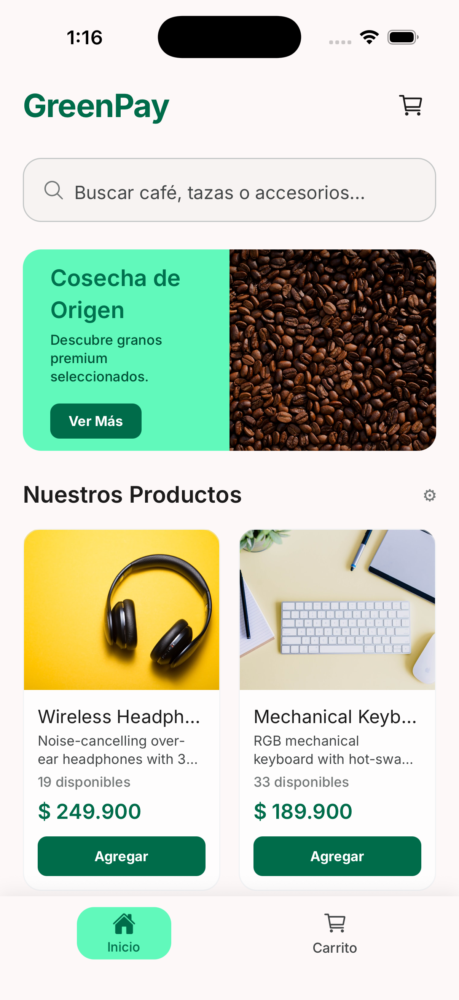
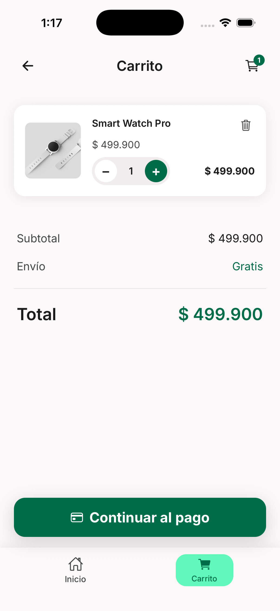
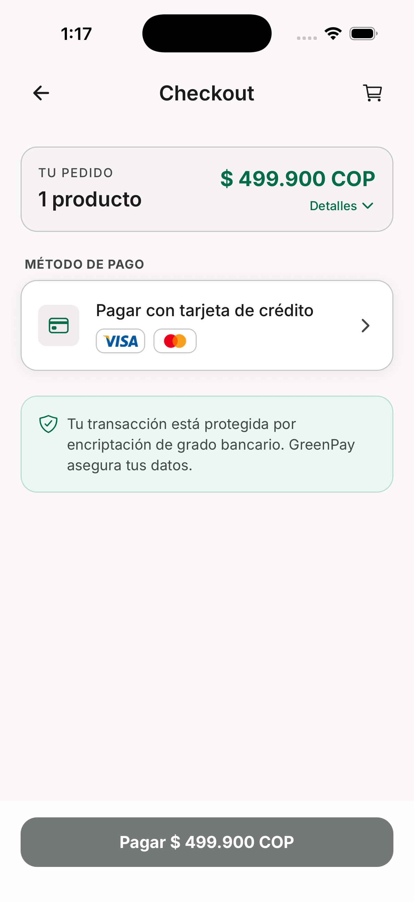
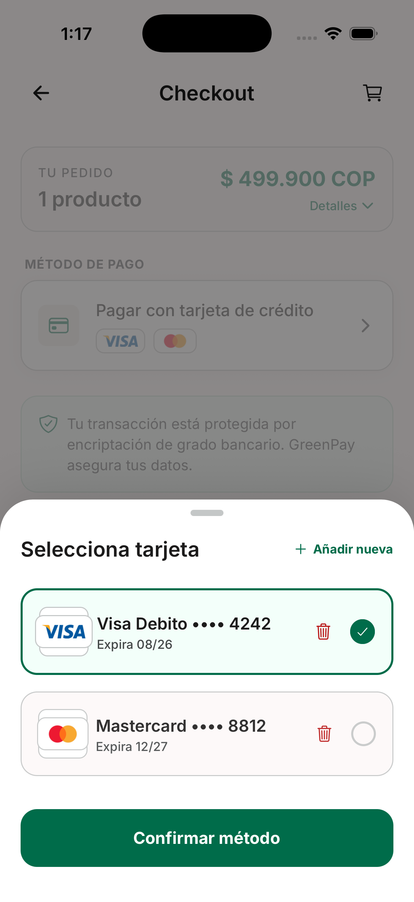
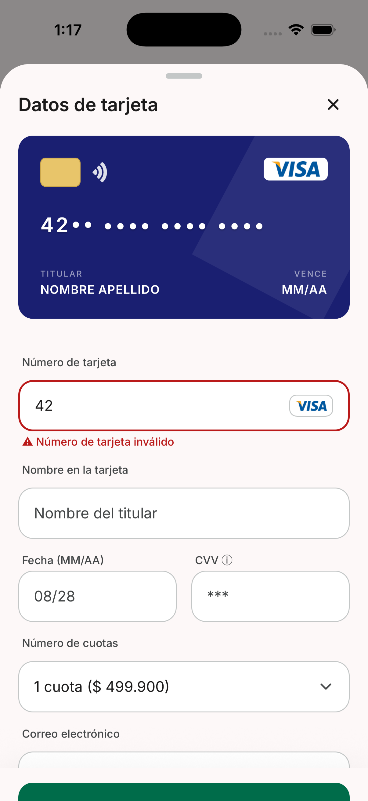
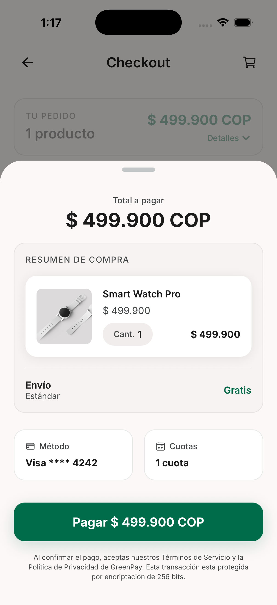
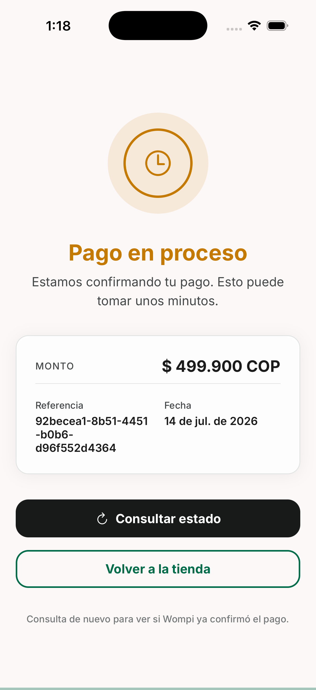
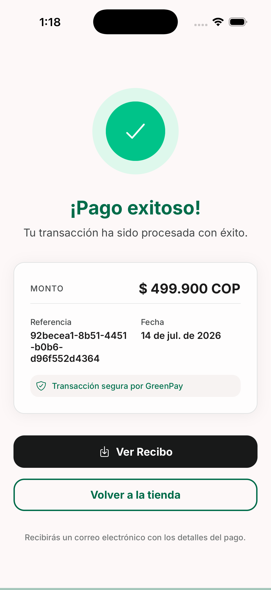
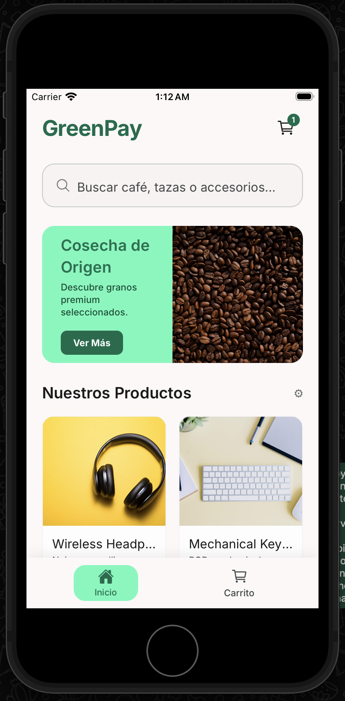

# GreenPay — Mobile App

Cross-platform mobile checkout built with **Expo SDK 57** + **React Native 0.86** + **TypeScript**. Brand: **GreenPay** — pagos simples y seguros.

## Download APK (Android)

Instala el build de release (no requiere cable ni Android Studio):

**[⬇ Descargar GreenPay 1.0.0 (APK release)](./releases/GreenPay-1.0.0-release.apk)**

| | |
|---|---|
| Archivo | [`releases/GreenPay-1.0.0-release.apk`](./releases/GreenPay-1.0.0-release.apk) (~96 MB) |
| API | `http://18.224.46.220:3000` |
| Notas | Firmado con keystore de debug (demo). Cleartext HTTP permitido hacia la IP del backend. En el teléfono: permitir “Instalar apps desconocidas” si Android lo pide. |

## Demo video

Flujo completo de la app (splash → pago exitoso):

**[▶ Ver / descargar video (`docs/demo/videoapp.mov`)](./docs/demo/videoapp.mov)** (~26 MB)

> GitHub **no reproduce** `.mov` embebido dentro del README (lo bloquea).  
> Al hacer clic en el enlace, GitHub abre el archivo con su **reproductor nativo**.  
> También puedes descargarlo y abrirlo en QuickTime / VLC.

<details>
<summary>Intento de embed (puede no verse en github.com)</summary>

<video src="./docs/demo/videoapp.mov" controls width="360" playsinline>
  Tu navegador no soporta video HTML5.
  <a href="./docs/demo/videoapp.mov">Descargar videoapp.mov</a>
</video>

</details>

## Tech Stack

| Technology | Version | Purpose |
|---|---|---|
| Expo | SDK 57 | Toolchain, modules & Metro |
| React Native | 0.86.0 | Mobile framework |
| React | 19.2.x | UI library |
| TypeScript | 5.x / 6.x | Type-safe language |
| Redux Toolkit | latest | State management (Flux) |
| React Navigation | 7.x | Screen navigation |
| Jest + jest-expo | 29.x | Unit testing (>80% coverage) |

## App Flow (7 Screens)

1. **Splash Screen** — Brand loading screen
2. **Home (Products)** — Product catalog grid with prices
3. **Cart** — Selected items with quantity controls
4. **Checkout** — Payment method selection
5. **Card Info** — Credit card form with Visa/MC detection (bottom sheet)
6. **Payment Summary** — Order review + confirm payment (bottom sheet)
7. **Transaction Result** — Success / Error / Pending status

## Screenshots

Capturas del flujo completo en **iPhone 17** (simulador). Archivos en [`docs/screenshots/`](./docs/screenshots/).

### 1. Splash


### 2. Home (catálogo)


### 3. Carrito


### 4. Checkout


### 5. Seleccionar tarjeta


### 6. Crear tarjeta


### 7. Resumen de compra


### 8. Pago en proceso


### 9. Pago exitoso


### Responsive — iPhone SE (2020)

Mínimo soportado **375×667**. Home en SE:



## Project Structure

```
android/              # Native Android project (Gradle) — committed
ios/                  # Native iOS project (Xcode/CocoaPods) — committed
src/
├── screens/          # 7 screen components
├── components/       # Reusable UI components (CardForm, ProductCard, etc.)
├── store/            # Redux store configuration
│   └── slices/       # cartSlice, paymentSlice (API data via React Query)
├── services/         # API client, payment service
├── utils/            # Card validation, encryption, formatters
├── navigation/       # Stack navigator config
├── types/            # TypeScript interfaces & types
└── assets/           # Images, fonts
```

## Getting Started

### Prerequisites
- Node.js 22.13+
- npm 10+
- Android Studio (for Android) or Xcode (for iOS)
- JDK 17+ (Android)
- CocoaPods (iOS, macOS only)

### Install & Run

```bash
# Install dependencies
npm install

# iOS pods (macOS only)
npm run ios:pods
# or: cd ios && pod install && cd ..

# Start Metro / Expo Dev Tools
npm start

# Run via Expo (uses local android/ / ios/)
npm run android
npm run ios

# Run tests
npm test
npm run test:coverage
```

### API (Nest on EC2)

```bash
cp .env.example .env
# EXPO_PUBLIC_API_BASE_URL=http://18.224.46.220:3000
```

- Home → `GET /api/products`
- Pay → `POST /api/transactions`
- Docs: http://18.224.46.220:3000/api/docs  

Restart Metro after changing `.env` (`npx expo start -c`).

Visa mock `**** 4242` uses the Wompi sandbox test card. Prefer **Añadir nueva** with a real sandbox card for full flow.

## Hybrid native builds

You can work either through Expo or by entering the native folders.

### Android (Gradle)

Gradle needs the Android SDK. On this machine the SDK is usually at
`~/Library/Android/sdk`. Create `android/local.properties` (gitignored):

```properties
sdk.dir=/Users/<YOU>/Library/Android/sdk
```

Or export once in your shell (use **JDK 17–21**, not Java 25 — Android Studio’s JBR works):

```bash
export ANDROID_HOME=$HOME/Library/Android/sdk
export JAVA_HOME="/Applications/Android Studio.app/Contents/jbr/Contents/Home"
export PATH=$PATH:$ANDROID_HOME/platform-tools
```

```bash
# Debug APK
npm run android:assemble
# or: cd android && ./gradlew assembleDebug

# Release APK
npm run android:release
# or: cd android && ./gradlew assembleRelease

# Install debug build on a connected device/emulator
npm run android:install
```

- Debug APK (local build): `android/app/build/outputs/apk/debug/app-debug.apk`
- Release APK (local build): `android/app/build/outputs/apk/release/app-release.apk`
- **Release APK (descarga del repo):** [`releases/GreenPay-1.0.0-release.apk`](./releases/GreenPay-1.0.0-release.apk)

> The API on EC2 uses **HTTP** (cleartext). Release builds allow it via
> `android:usesCleartextTraffic` + `network_security_config.xml` for `18.224.46.220`.
> After changing those files, rebuild and refresh `releases/GreenPay-1.0.0-release.apk`.

### iOS (Xcode / CocoaPods)

```bash
npm run ios:pods
# or: cd ios && pod install

# Then open in Xcode
open ios/PayCheckoutApp.xcworkspace
```

Or simply `npm run ios` to build and launch the simulator via Expo.

### Regenerating native projects

If you change `app.json` plugins / identifiers and need a fresh native sync:

```bash
npm run prebuild        # sync without wiping custom native edits
npm run prebuild:clean  # wipe and regenerate android/ + ios/
```

> Prefer small native edits carefully: `prebuild --clean` will overwrite generated files.

## Unit tests (Jest) — mandatory >80% coverage

Unit tests run with **Jest** + **jest-expo**. Covered areas: Redux slices, card validation utils, API services/hooks, and UI components/screens (RTL).

```bash
# Run all unit tests
npm test

# Run with coverage report
npm run test:coverage
```

### Coverage results

Generated with `npm run test:coverage` (Jest `--coverage`). **Requirement met: >80%.**

| Metric | Coverage |
|---|---|
| Statements | **92.91%** (695/748) |
| Branches | **88.38%** (449/508) |
| Functions | **85.30%** (209/245) |
| Lines | **93.75%** (676/721) |

```
=============================== Coverage summary ===============================
Statements   : 92.91% ( 695/748 )
Branches     : 88.38% ( 449/508 )
Functions    : 85.3% ( 209/245 )
Lines        : 93.75% ( 676/721 )
================================================================================
```

- **Test suites:** 33 passed  
- **Tests:** 141 passed  
- Specs live under `__tests__/` (Jest).

## Responsive Design

Minimum supported screen: **iPhone SE (2020)** — 375x667 pt.
All UI components use flexible layouts with anchors to adapt across screen sizes.

## License

Private — not for distribution.
